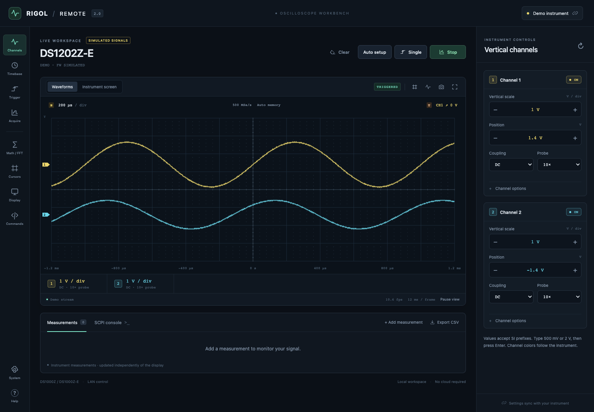

# Rigol Remote

A local oscilloscope workbench for Rigol **DS1000Z / DS1000Z-E** instruments. Rebuilt with a responsive dark interface, calibrated waveform rendering, guarded SCPI transport, and a searchable command library.



## Run

Requires **Python 3.11+** and an oscilloscope reachable over LAN. No Node.js, frontend build, VISA drivers, cloud service, or external fonts are needed.

```sh
python3 -m venv .venv
source .venv/bin/activate                 # Windows: .venv\Scripts\activate
python3 -m pip install -r requirements.txt
python3 rigol-remote.py
```

Open **http://127.0.0.1:8080**, select **Connect instrument**, and enter the instrument address and SCPI port (normally `5555`). Find the address under **Utility → IO Setting → LAN** on the Rigol.

Connect on startup:

```sh
python3 rigol-remote.py --scope 192.168.212.202 --scope-port 5555
```

Explore without hardware:

```sh
python3 rigol-remote.py --demo
```

`python3 -m rigol_remote` is an equivalent entry point. Use `--port 8081` to change the HTTP port. The default server listens only on localhost. `--host 0.0.0.0` makes it available to other devices on a trusted LAN; this application does not provide user authentication.

## Controls

- Run/stop, single acquisition, force trigger, autoscale, and clear.
- Two or four channels, detected from the model: scale, position, coupling, probe ratio, bandwidth limit, inversion, fine adjustment, and amplitude unit.
- Main and delayed timebases, horizontal position, Y–T / X–Y / roll.
- All 15 trigger types, with common and edge controls in the side panel; type-specific parameters in the command library.
- Acquisition type, averaging, channel-dependent memory depth, and full acquisition memory download.
- Instrument math and FFT controls, including sources, operator, window, units, scale, and frequency center.
- Draggable local time cursors with Δt and 1/Δt; separate controls for the instrument's own cursors.
- Local trace persistence and grid settings, plus controls for the physical display.
- Up to 16 configurable instrument measurements. None are enabled automatically; selected measurements refresh slowly to protect the instrument firmware.
- A library of **368 command families** from the DS1000Z-E programming guide: serial decoding, reference traces, recording/playback, pass/fail, storage, system, and more. Select a query or setting, replace placeholders, and send. Availability and legal parameter ranges depend on model, firmware, options, and current instrument state.
- SCPI console with history and downloads for binary query replies. One query per line; use absolute command paths after semicolons. The console accepts ASCII commands, not binary uploads. Writes do not trigger an automatic error-queue query; use `:SYSTem:ERRor?` explicitly when needed.

Common settings have dedicated controls; less common functions use the command library. This is not a claim that every library command has been exercised on physical hardware. Optional MSO digital channels and signal generators do not have dedicated controls in this DS1000Z-E catalog.

Numeric fields accept scientific notation and SI prefixes, for example `500 mV`, `20 us`, `2 ms`, or `1e-3`. Press Enter or leave the field to apply. A changed field is read back once. There is no automatic settings polling; use the refresh button in the control panel when settings are changed on the physical front panel.

Keyboard shortcuts, when no field or dialog is active:

| Key | Action |
| --- | --- |
| Space | Run / stop |
| S | Single acquisition |
| A | Autoscale |
| C | Clear display |
| F | Fullscreen waveform display |
| ? | Workbench guide |

## Refresh and the two display modes

**Waveforms** reads each enabled channel using `:WAVeform:MODE NORMal`, `:WAVeform:FORMat BYTE`, `:WAVeform:PREamble?`, and `:WAVeform:DATA?`. Up to 1,200 samples per channel are sent to the browser as binary WebSocket messages. The browser renders them on a high-DPI canvas. Calibration is read with each trace; no intermediate acquisitions are synthesized.

The old application requested a whole PNG every 300 ms and opened separate TCP connections for commands. The new application serializes communication, keeps text commands ordered, and uses a disposable connection for every binary response because DS1202Z-E firmware can leave waveform bytes after the declared block. It retains only the latest pending frame for each browser, so slow browsers cannot create an unbounded backlog. The initial target is 10 fps and is adjustable from 5 to 60 fps; the counter reports the **actual rate of received frames**. Start conservatively on real hardware and raise it only after checking stability.

**Instrument screen** downloads the original PNG display, including math/FFT traces, decoding, menus, XY/roll/delayed views, hardware cursors, and instrument persistence. This mode targets at most three screenshots per second. It is unavailable in the demo.

The instrument's internal waveform capture rate, its LCD refresh, and SCPI transfer rate are different quantities. A 60 fps setting cannot make the instrument deliver 60 acquisitions per second over SCPI. Channels are read sequentially and are not guaranteed to come from the same acquisition; stop the instrument before comparisons requiring a common frozen acquisition. The displayed acquisition latency includes the complete per-channel transfer cycle.

The fast view renders the main analog Y–T samples. Use Instrument screen to inspect results of the instrument's math, decoding, XY, roll, and delayed-timebase functions. Local persistence only accumulates traces actually received by this browser and does not reproduce the instrument's intensity grading.

## Export

- **Camera**: PNG of the displayed waveform view, including local cursors, scale, and retrieval timestamp; in Instrument screen mode it saves the last received screenshot.
- **Export CSV**: last acquired screen samples with calibration applied, channel numbers, times, and instrument/retrieval metadata. Pause the view first to hold the exported screen capture steady. Screen samples are not the full acquisition memory.
- **Acquire → Download memory ZIP**: stop acquisition, select an enabled channel, and download the full memory in chunks of at most 250,000 BYTE samples. The ZIP contains `channelN.bin` and `metadata.json`. The application does not stop or resume the instrument automatically for this operation.
- **System → Download instrument PNG**: a fresh physical-screen capture.
- **System → Save workspace settings**: a JSON snapshot of the settings read by the workbench, for reference. It is not a complete Rigol setup backup or an importable setup file. A full instrument setup can be queried with `:SYSTem:SETup?` in the command library.

For a zero-based sample index `i` and unsigned byte `b`, calibration is:

```text
time_s = (i - x_reference) * x_increment + x_origin
amplitude = (b - y_origin - y_reference) * y_increment
```

Memory export restores the previous waveform-transfer configuration afterward. Normal connection preserves RUN/STOP, trigger, channel, and acquisition settings. An orderly disconnect restores the transfer settings saved when connecting. If the network fails, an in-flight reply is interrupted, or a text query receives binary/control bytes, streaming stops and the connection is discarded immediately. Reconnect explicitly after checking the instrument. Writes are never automatically replayed after a timeout.

All browser tabs share one instrument session. Connecting, disconnecting, selecting the stream mode, pausing the view, and selecting live measurements affect that shared session. Local cursors, local persistence, and fullscreen belong to each browser. **Pause view does not stop acquisition.**

## Validation and hardware benchmark

```sh
python3 -m unittest discover -s tests -v
python3 tools/benchmark.py 192.168.212.202 --frames 20
```

Tests cover fragmented binary blocks, optional terminators, concurrent queries, timeouts, cancellation, disposable binary connections, waveform calibration, exports, shared streaming, and HTTP control boundaries. The benchmark compares calibrated binary channel transfers with PNG captures and restores waveform-transfer settings. Close other SCPI clients before benchmarking.

Browser checks are optional development tooling:

```sh
python3 -m pip install playwright
python3 -m playwright install chromium
# Start the application with --demo in another terminal, then:
python3 tools/browser_check.py
```

The screenshots in this README were captured from the demo. The supplied DS1202Z-E running firmware `00.06.03.SP2` was tested directly. A zero-length preamble returned while the trigger was waiting is handled without requesting waveform data. A bounded six-frame test of the disposable binary connections retrieved CH1 and CH2 every time, completed an unchanged CH1 scale write/readback, and received a valid final `*IDN?`. After the first 335 ms frame, the two-channel transfers took 129–137 ms each. This is a bounded protocol check rather than a long-duration stability claim; performance varies with timebase, trigger state and enabled channels. Simulator performance is not a hardware benchmark.

## Structure

```text
rigol-remote.py            Compatibility launcher
rigol_remote/scpi.py      Serialized TCP transport and IEEE block framing
rigol_remote/scope.py     Instrument state, calibrated reads, memory export, demo
rigol_remote/server.py    aiohttp server, guarded acquisition, WebSockets, downloads
rigol_remote/catalog.json DS1000Z-E command syntax and enum values
frontend/                 HTML, CSS, canvas renderer, controls, application logic
tests/                    Standard-library unittest suite
tools/                    Hardware benchmark and browser checks
```

Protocol reference: [Rigol DS1000Z-E Programming Guide](https://www.rigol.com/dam/global/downloads/brochures/en/program-guide/oscilloscopes/DS1000ZE_ProgrammingGuide_EN.pdf). The command catalog contains command signatures and parameter values; consult the guide for conditions, ranges and model-specific behavior. Server API reference: [aiohttp documentation](https://docs.aiohttp.org/en/stable/web_quickstart.html).

[MIT License](LICENSE).
