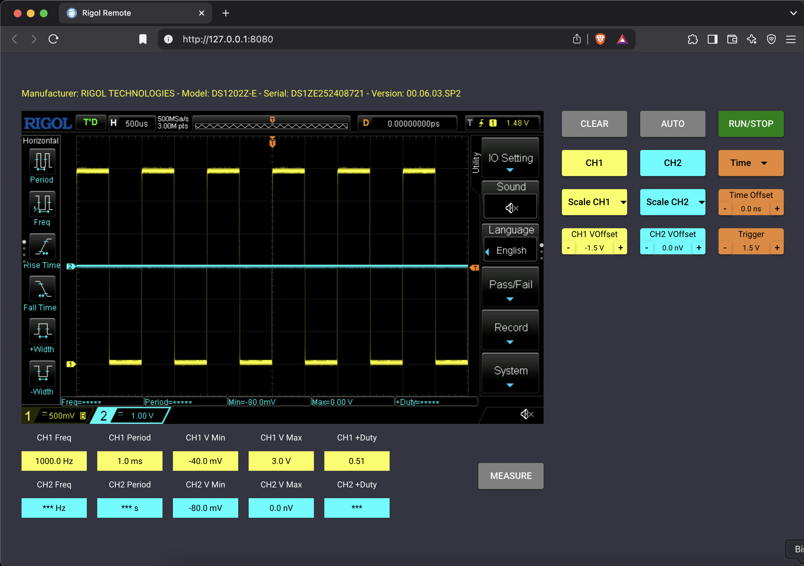

# Rigol Remote

A simple remote control for Rigol oscilloscopes that support the DS1000Z protocol. This tool has been tested on a Rigol DS1202Z-E and is built using Python and [NiceGUI](https://nicegui.io/) without requiring other external libraries.



## Features

- Remote control of DS1000Z-based Rigol oscilloscopes
- Simple Python application with a lightweight dependency: NiceGUI
- Tested on the DS1202Z-E model
- Minimal setup and configuration needed

## Requirements

- Python 3.7+  
- [NiceGUI](https://nicegui.io/) (installed automatically via `requirements.txt` or `pip install nicegui`)

No additional libraries are required beyond NiceGUI.

## Installation

1. **Clone the repository**:
   ```bash
   git clone https://github.com/emanuelelaface/rigol-remote.git
   cd rigol-remote
   ```

2. **Install dependencies**:
   ```bash
   pip install nicegui
   ```

   *(If you prefer using `requirements.txt`, simply run:)*  
   ```bash
   pip install -r requirements.txt
   ```

3. **Run the application**:
   ```bash
   python rigol_remote.py
   ```

4. **Open the interface**:

   After starting the application, open your web browser and navigate to the URL shown in your console (usually `http://localhost:8080`).

## Usage

1. **Connect your Rigol oscilloscope** to the same network as your computer running `rigol_remote.py`.
2. **Enter the oscilloscope IP address** in the web interface.
3. Use the GUI to **capture waveforms**, **adjust settings**, or perform **remote measurements**.

## Contributing

1. Fork the project.
2. Create a new branch: `git checkout -b feature/your-feature`.
3. Make your changes.
4. Submit a pull request.

## License

This project is provided under the [MIT License](LICENSE).

---  

Feel free to adjust or expand the sections to meet your needs.
